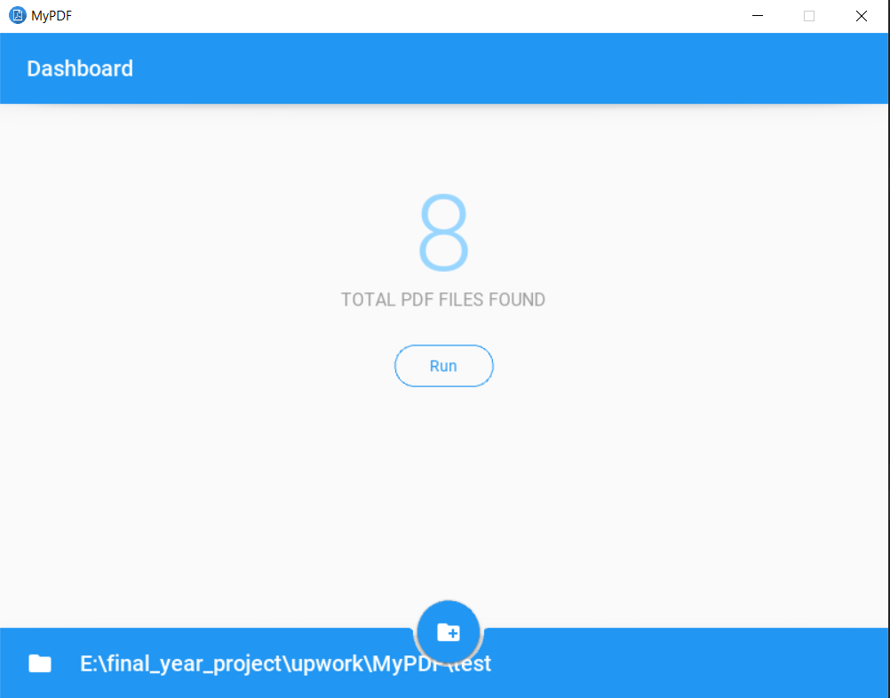

# MyPDF-GUI
Desktop Application to extract text from pdf and rename it as per the given format

#### Prerequisites

######Supported Platforms
* Windows
* Linux
```
$ pip install -r requirements.txt
```


#### Build Standalone Desktop App
* https://groups.google.com/g/kivy-users/c/Px4gCDUu6ho


#### Input and Output
<p align="center">
  
</p>

#### Usage

1) Select Folder where you have stored your all the PDF
    (NOTICE: FOLDER NAMES & FILE NAMES MUST BE IN ENGLISH)
    
2) Hit Run button to process all the PDF's

3) After process completion check OUTPUT Folder, you will see your desired output